## **1. 프로젝트 개요** 

  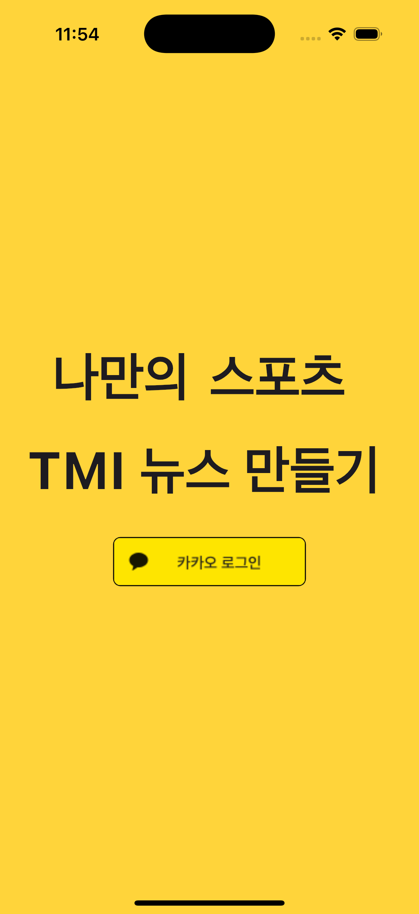
  
  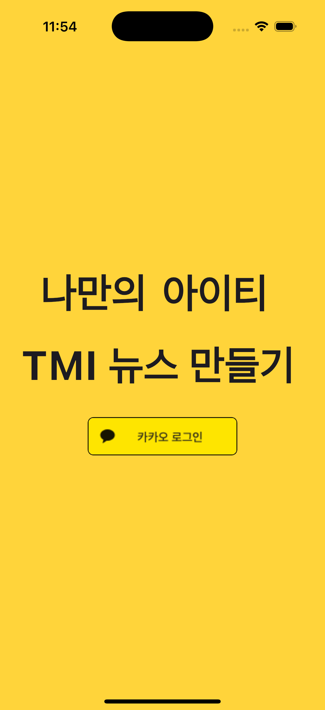

> TMI NEWS – AI 기반 뉴스 생성 & 큐레이션 서비스
> 
> 
> > 키워드만 입력하면, 나만을 위한 뉴스가 만들어진다!
> > 

**TMI NEWS**는 사용자가 원하는 주제의 뉴스를 손쉽게 받아볼 수 있도록 돕는 AI 기반 뉴스 생성 및 큐레이션 서비스입니다. 사용자가 입력한 키워드를 바탕으로 AI가 기사 초안을 작성하고, 관리자는 이를 검토해 수정 및 승인할 수 있습니다. 또한 사용자 피드백을 기반으로 뉴스 콘텐츠를 개선하고, 개인화된 뉴스 큐레이션 경험을 제공합니다.

## **2. 주요 기능**

### 🧠 **AI 뉴스 생성**

- **뉴스 생성 방식**
    - 사용자가 먼저 **카테고리 6종 중 하나**를 선택 (예: `IT`, `사회`, `연예`, `재테크`, `건강`, `스포츠`)
    - 이후 **본문 내용**을 자유롭게 입력 (예: “요즘 아이폰 15 프로 발열 이슈에 대한 내용 작성해줘”)
    - 입력된 내용은 **AI가 분석 → 뉴스 형식으로 자동 변환**함

  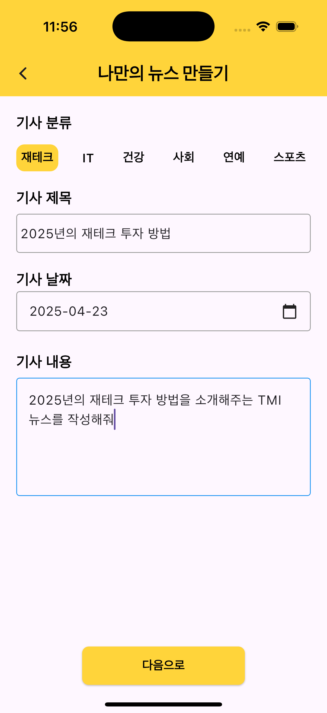
  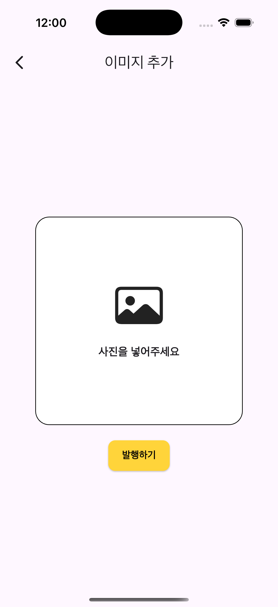
  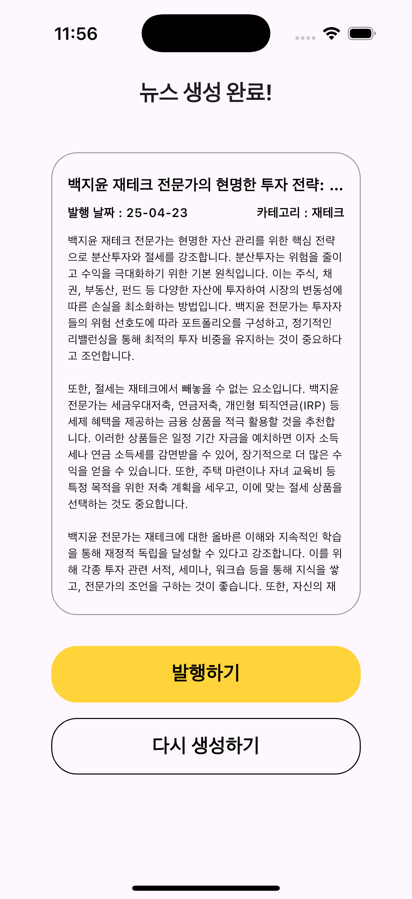

- **생성 결과**
    - 사용자가 작성한 주제에 따라 AI가 제목 / 본문 의 구조로 뉴스 작성
    - 결과가 마음에 든다면 발행하기 버튼을 통해 최종 발행 후 뉴스 발행 완료

### 📚 **뉴스 피드 (카드 뉴스형 UI)**

- 뉴스는 **카드 형식으로 정렬되어 피드에 출력**됩니다.
- 피드는 `카테고리 탭`(IT, 사회, 연예, 재테크, 게임, 스포츠 등)을 기준으로 필터링 가능하며, 기본 정렬은 **최신순**입니다.
- 각각의 뉴스 카드는:
    - 제목과 요약이 보여지며
    - 컬러 구분으로 카테고리를 직관적으로 인식할 수 있습니다.
- 사용자는 스크롤을 통해 다양한 주제의 뉴스를 **SNS처럼 빠르게 탐색**할 수 있습니다.

  
  
  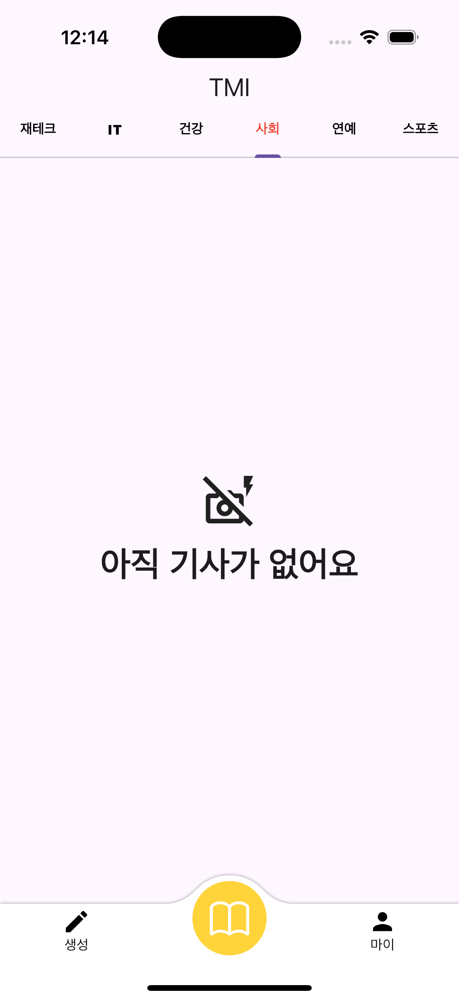

  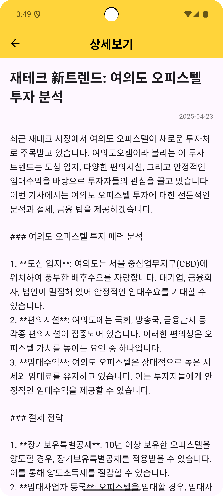
  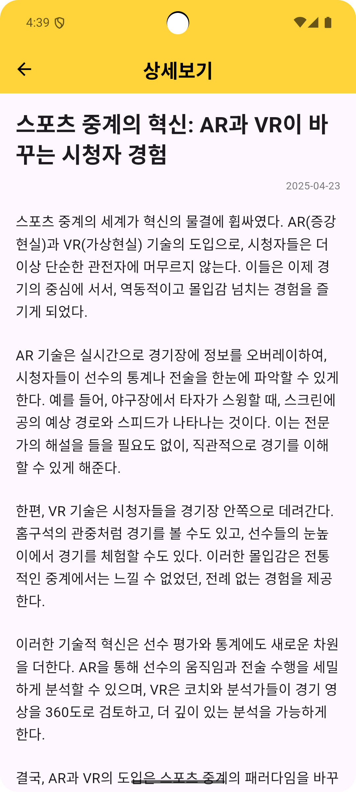
  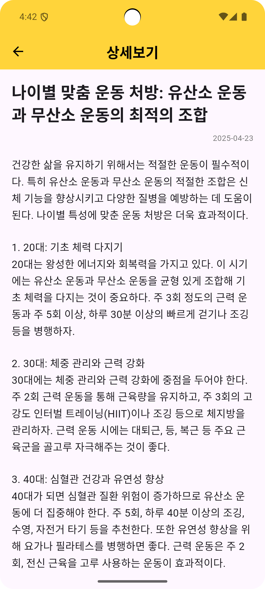

### ❤️ **좋아요 & 댓글**

- **좋아요 기능**
    - 뉴스 상세 페이지 하단에 위치한 ❤️ 버튼을 눌러 **좋아요를 표현**할 수 있어요.
    - 누른 좋아요 수는 실시간으로 반영되며, 인기 뉴스는 피드 상단에 더 잘 노출됩니다.
- **댓글 기능**
    - 사용자는 뉴스 하단에 바로 보이는 **입력창을 통해 댓글을 남길 수 있어요**.
    - 입력창에는 “댓글을 작성해보세요”라는 안내가 있으며, 작성 후 바로 아래 리스트에 반영됩니다.
    - 댓글에는 **작성자 닉네임과 작성 내용**이 함께 표시되어, 간단한 의견부터 감정 공유까지 자유롭게 표현할 수 있습니다.
    - 예시:
        - 김예지: “와 유용한 글이에요~”
        - 박호철: “좋은 기사 감사합니다ㅎㅎ”
        - 김홍탁: “앞으로도 좋은 콘텐츠 기대할게요!”
- **특징**
    - 인스타그램 스타일로 **입력 → 즉시 반영되는 반응형 구조**
    - 별도 새 창 없이 **본문과 댓글을 한 화면에서 몰입감 있게 확인 가능**

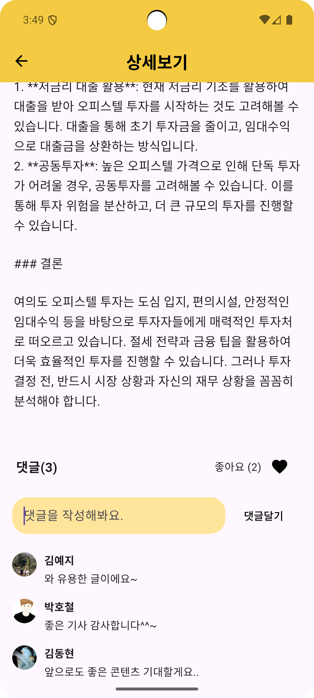

### ☘️ **마이페이지**

- **글 모아보기 기능**
    - 지금까지 내가 쓴 기사들을 모아볼 수 있어요.
- **알림 기능**
    - 내가 쓴 글에 좋아요, 댓글이 달렸을 때 / 친구 신청, 완료의 경우에 알림이 와요
- **친구 기능**
  - 친구를 맺고 친구가 쓴 글을 모아서 확인할 수 있어요.

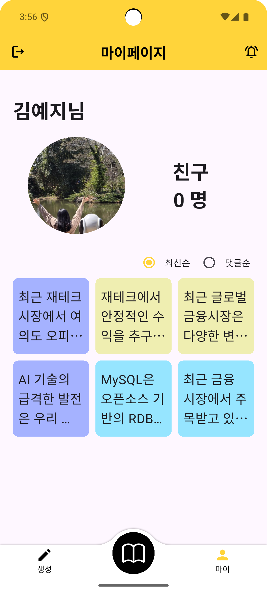
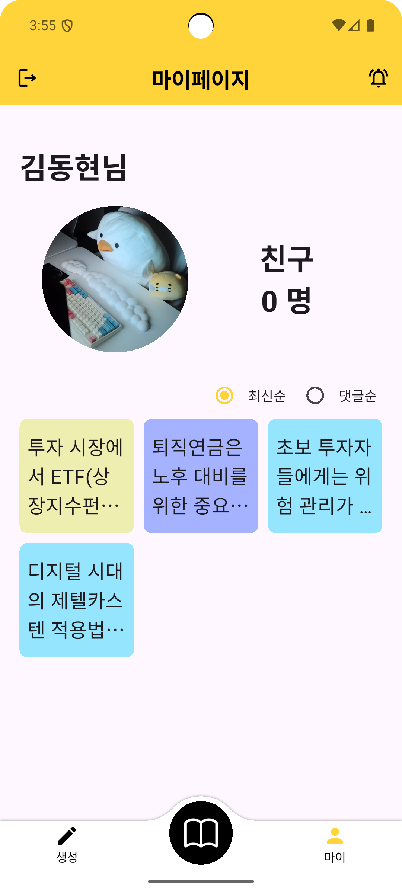

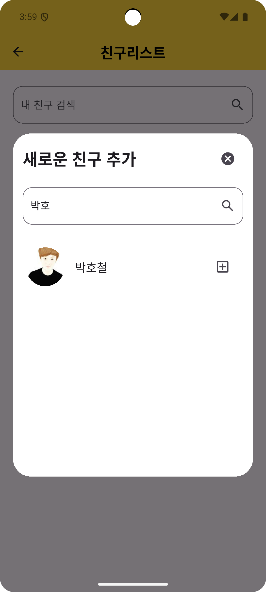

---

## **3. 사용 기술**

### FRONTEND

  
  

### AI

  
  
  

### BACKEND

  
  

### TOOLS

  
  
  

## **4. 문서**

- [Figma (목업)](https://www.figma.com/design/b7wOUcVQ3qNW3CtGvSU0UG/Untitled?node-id=55-5&p=f&t=wTdJ3H2rx9C7oAsX-0)
- [API 명세](http://notion.so/API-1af627ac5de580199718fd43c3f80556)
